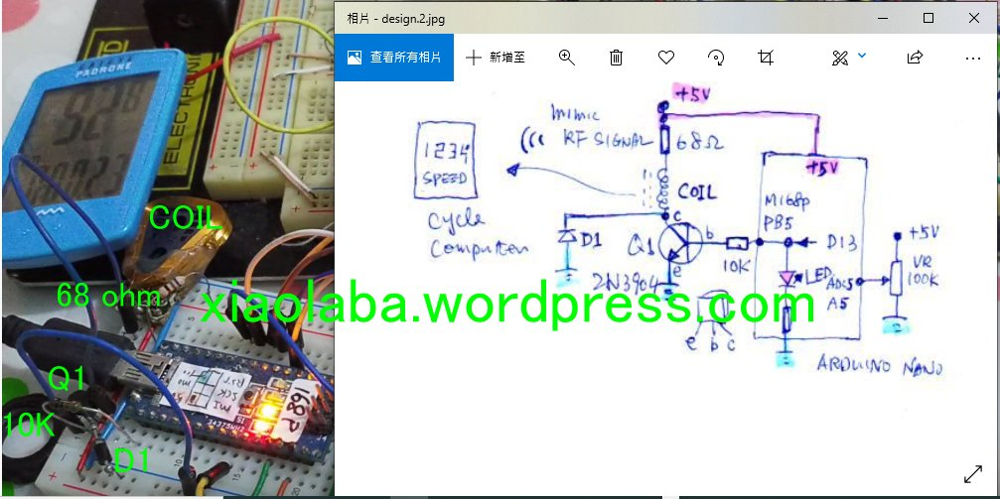
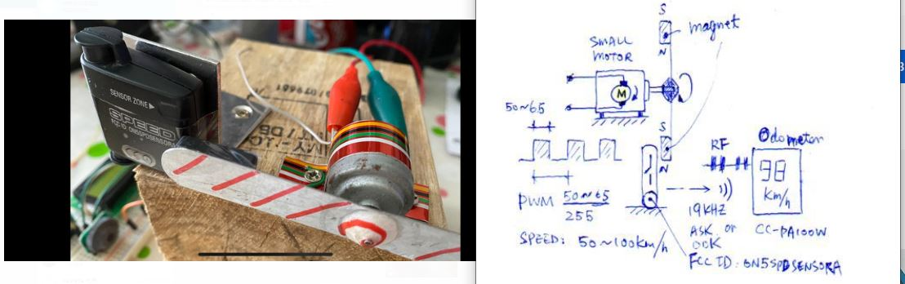
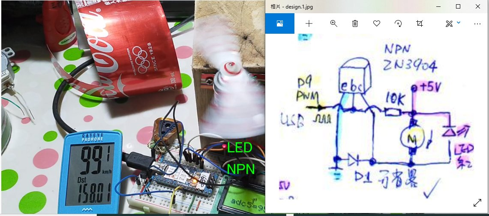
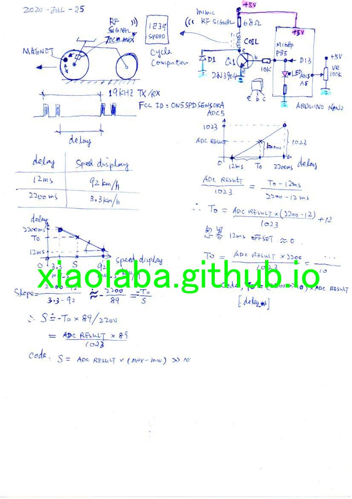
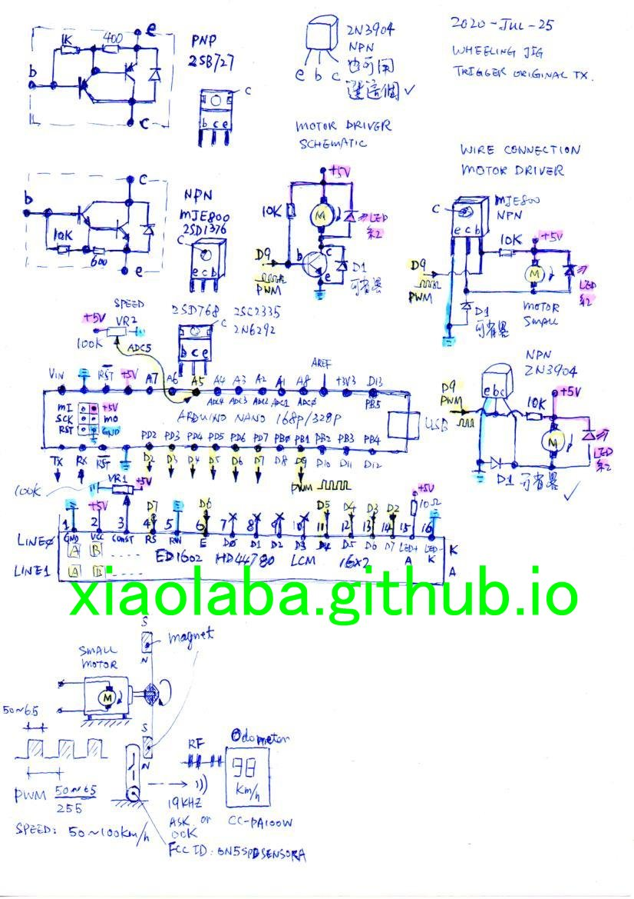

# Cyclocomputer-CC-PA100W-weak-signal-and-clone-possible
### STEM project, to learn and practices.  One of customers is telling the dissatisfaction, what, why & how.  
  
It is one day project, the target, a "fancy" product with new name to us - "Cyclocompetuer". User told that malfuction intermittent as no blinking of counting during biking. To complete & writting the report of project has more than weeks and slowly, not a single day event because no urgent.  

Verify the case and used what learned for STEM project.  
  
1) RF signal transmission and reception, mimic RPM singal without real biking, nor uses the original RPM transimitter.  
2) PWM and smaller brush motor speeding control, to mimic the biking to produce RPM signal; ADC for set point;  
3) Coding technique for simple scalling & filtering, i.e. ADC range 0-1023, mapping to speed setting 0-63; ADC result filteried, more immunity to noise, steady ADC reading;  

### Odometer & RF signal for RPM
According to user, a brand named product, few years aged model, https://www.cateye.com/files/manual_dl/9/965/CC-PA100W_HP_TC_v2-1.pdf. It is a 19 KHZ transmitter with a reed switch, wheeling per revolution detected, sent two pluses via RF singal to odotometer. FCC ID https://fcc.report/FCC-ID/ON5SPDSENSORA, designed in year 2005.  

### Theory
Operation, rolling magnet trigger the reed switch, RF signal generator pulsing ASK (Amplitude Shift Keying) or OOK (On-off-keying) signal to odometer, it was said 70cm aprat in maximum, test result, this unit pair was no better than 45cm apart otherwise no singal. On the other hands, 99.9km/h is max, over plusing, no RPM counting was capable; low end 3.3km/h was able to display; Counting event against time, odometer could be used to display many functions of time related, for example speed, trip distant, ect.  
  
  
### Journey of the practices  
###    1. build the test rig, clone the RF signal, try to mimic RF single, confirmed RF 19KHZ ASK signal
simple coil used as detector and antenna, schematic.  

  
.  

Quickly turning on/off of a coil, it radiates RF signal, in reversed way, a coil will detects RF signal when the magnetic field has changed or collapsion. Transistor Q1 (2N3904) is acting as switch for coil and on/off. Diode D1 is protecting Q1 away from damage by coil & high voltaged generated. On board LED of Arduino Nano (pin# D13) is blinkg when coil is in action.


###    2. build the "wheeling" jig, trigger original RF transmitter, pretending biking  
mimic real biking. Rotating of two magnets, mimic the wheeling sucessufuly, 5V power and PWM control to the motor, it is easy and govenered slow RPM.  


Starting at low PWM is not possible as load and friction, PWM ratio of 40/255 to 63/255 seems the best fit for the case and the specific small motor.

###   3. Motor driver circuit  
One transistor is good enough, 2N3904 or MJE800, both tested as works well, general NPN would be ok, LED is free-wheeling diode for transistor & protection, conincidently, it lites up when motor is in action due to back EMF of motor running, the schematic,  
  


.  
.  
.  
### Code and hints
These code build with Arduino IDE, under laying is actual avr-gcc, some mix of pure C and/or Arduino C++.

#### Filtering signal and easy 8 bit MCU (AVR or Arduino Nano / Uno)  
####   1. Reading ADC for set point, uses software RC filter
Many online tutorial was telling to sum as many as possible sample reading from ADC, kicks out max/min, find the average, some sort of similar to MOVING AVERAGE method (類似移動平均法). It was ok and works, but what is the point to count so many and averaging? There is trick that could be used, to uses RC filter in hardware before feeding input to ADC, one resistor and one capacitor (integrator) will do the job, usually 10K/0.01uF. One advance trick is using software to build such RC filtering, simple, fast & better than hardware RC filter, code snippet following, FILTER_SHIFT is RC constant, the greater number the longer response time and vise versa. I did not invented this but learned from those someone who was working for NASA & Appollo, it is fun of learning and finally understood the beauty of code / algorithm design, it was used to flying to the moon, it is working here today.
```  
   uint16_t s = analogRead(A5); // speed setting  
   
   FILTER_SHIFT =2;  
   integrator = integrator - (integrator >> FILTER_SHIFT) + s;  
   s = integrator >> FILTER_SHIFT;  

```  

####   2. Scaling ADC result to set point
AVR MCU has ADC result (10 bit mode) in range 0-1023, but the speeding set point is 0-64. how to do that scaling ?
Brushed DC Motor speed is proportional to supply voltage, PWM control is effectively to vary & averaging supply voltage to this, for example, 5V battery and the smaller motor, quickly turning on/off the motor supply at even interval at 50/50%, the motor will spinning as seeing 5V/2 = 2.5V supply, the speed is around 50%, to vary the ratio of on/off time, motor is speeding up or slowing down accordingly, more power and then more speed, it is the idea.  

The code, S>>4, it is equally 1023/2^4 = 1023/64 = 64, this is the scaling of 0-64. if higher speed is antcipated, S>>3 or s>>2 could be used;  

The code, why limit S to 65 ? Perfect dynamic balancing for simple motor & homemade test jig was not possible, it is too dangerous and magnets became projectile if motor speed it was too high.  


```  
   s=s>>4; //scale down to 0-255 of PWM setting
   if (s>=65) {s =65;}
```  

####   3. Generate PWM signal  
AVR MCU has hardware pin for PWM, this simple method has set ratio of on/off time, the ratio is (on_time/255), omits the frequency but it is ok for our target and goal,
```  
  analogWrite(9,50);  // generate PWM signal, arduino Nano D9 pin, AVR maga328/168 PB1, PWM ratio, on/off time 50/(255-50)%  
```  

To drive the motor, PWM signal input by D9 [(see motor driver circuit)](#3-motor-driver-circuit), plusing NPN transistor (2N3904 or MJE800) & turned on/off quickly, motor will see supply voltage in averaging to a "set point", speed is controlled. but no feedback of this design, it may vary a very little depends on +5V and the motor loading, havier & stronger magnets, all accountable.

### conclusion
the smaller brush motor and open-loop control, easy for wheeling and testing.  
result, https://www.youtube.com/watch?v=OulV7slnkP8  
.  
.  
### complete circuit diagram  
  
.  
.  


